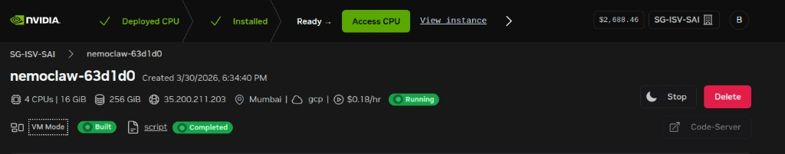

# Installation Guide

[NVIDIA NemoClaw](https://docs.nvidia.com/nemoclaw/latest/index.html) is an open source reference stack that simplifies running [OpenClaw](https://openclaw.ai/) always-on assistants more safely. It installs the NVIDIA OpenShell runtime, part of NVIDIA Agent Toolkit, an environment designed for executing claws with additional security, and open source models like NVIDIA Nemotron.

This installation guide walks you through getting NemoClaw running end to end with different setup options. The installation process consists of 3 main steps.
1. Step 01: Environmental setup
1. Step 02: Install NemoClaw
1. Step 03: Policy preset (optional)


You can choose your desired installation method from the options below: 
#### Option A: Brev NemoClaw Launchable - Complete browser-based development envionment
#### Option B: Brev NemoClaw Launchable - Connect to Cursor IDE (Linux host machine)
#### Option C: Brev NemoClaw Launchable - Connect to Cursor IDE with WSL (Windows host machine)
#### Option D: Setup NemoClaw on DGX Spark


## Prerequisites

### Hardware

| Resource | Minimum | Recommended |
|----------|---------|-------------|
| CPU | 4 vCPU | 4+ vCPU |
| RAM | 8 GB | 16 GB |
| Disk | 20 GB free | 40 GB free |

The sandbox image is approximately 2.4 GB compressed. During image push, the
Docker daemon, k3s, and the OpenShell gateway run alongside the export pipeline,
which buffers decompressed layers in memory. On machines with less than 8 GB of
RAM, this combined usage can trigger the OOM killer. If you cannot add memory,
configuring at least 8 GB of swap can work around the issue at the cost of
slower performance.

### Software

| Dependency | Version |
|------------|---------|
| Linux | Ubuntu 22.04 LTS or later |
| Node.js | 22.16 or later |
| npm | 10 or later |
| Container runtime | Supported runtime installed and running |
| OpenShell | Installed |

### API Key (if using NIM endpoints)

NVIDIA API key from [build.nvidia.com](https://build.nvidia.com) — not needed if hosting a local LLM.

```bash
export NVIDIA_API_KEY=nvapi-xxxx
```

---

## Step 1: Set Up Your Environment

Pick one of the options below, then continue to [Step 2](#step-2-install-nemoclaw).

### Option A: Brev NemoClaw Launchable

1. Go to the [NemoClaw Launchable](https://brev.nvidia.com/launchable/deploy?launchableID=env-3Azt0aYgVNFEuz7opyx3gscmowS&ncid=no-ncid) page to launch a NemoClaw Launchable instance.

2. Click **Deploy Launchable**.

3. Wait for the VM to be built and the setup script to complete. You should see **Built** and **script Completed** status badges:

   

4. Click **Code-Server** to open a browser-based IDE, then follow the NemoClaw installation `README.md` inside the instance.

5. **[OPTIONAL]** Install the Claude Code extension inside Code-Server as a developer companion. If you prefer a native Cursor setup instead, see [Option B](#option-b-brev--ubuntu--cursor).

### Option B: Brev / Ubuntu / Cursor

> Requires completion of [Option A](#option-a-brev-nemoclaw-launchable) steps 1–3, and [Cursor](https://www.cursor.com/) installed on your local machine.

**First-time setup** — install the Brev CLI on your local Linux terminal:

```bash
sudo bash -c "$(curl -fsSL https://raw.githubusercontent.com/brevdev/brev-cli/main/bin/install-latest.sh)"
```

**Login** to your Brev account:

```bash
brev login
```

**Open** your Brev instance in Cursor:

```bash
brev open <instance-name> cursor
```

Cursor will connect to the remote instance via SSH. From there, continue to [Step 2](#step-2-install-nemoclaw).

### Option C: Brev / WSL2 / Cursor

> Requires completion of [Option A](#option-a-brev-nemoclaw-launchable) steps 1–3, and [Cursor](https://www.cursor.com/) installed on your Windows machine.

<!-- TODO: WSL-specific Brev CLI install, Cursor remote SSH setup -->

@TODO:Haritha

### Option D: DGX Spark

<!-- TODO: provisioning steps, access method -->

@TODO: Jovan

---

## Step 2: Install NemoClaw

> If you are using Code-Server (Option A), the install script runs automatically
> on first launch — just make your choices when prompted.

For Cursor setups (Options B/C/D), run manually:

```bash
cd ~/NemoClaw
bash ./install.sh
```
@TODO: Add guideline to get API key

When asked, choose:

- **Provider**: `nvidia-nim` (cloud) — or `ollama` / `vllm` if running a local LLM
- **Model**: `nvidia/nemotron-3-super-120b-a12b`
- **Policy**: `suggested` (to see approval flow)

Once installation is complete, head to [demo/1.0-basic.md](demo/1.0-basic.md) to run your first demo.

---

## Step 3: Post-Install (optional)

- [3.1 Add a Policy Preset](#31-add-a-policy-preset)
- [3.2 Switch Models at Runtime](#32-switch-models-at-runtime)
- [3.3 Launch LLM on a Remote GPU](#33-launch-llm-on-a-remote-gpu)

### 3.1 Add a Policy Preset

Add a built-in policy preset to allow specific network access:

```bash
nemoclaw <name> policy-add
# Select a preset, e.g.: telegram
```

The `telegram` preset is a default NemoClaw preset that allows the Telegram
bridge to reach the Telegram API. See [demo/2.0-telegram-bridge.md](demo/2.0-telegram-bridge.md)
for a full walkthrough.

> **Tip**: You can also create custom policies (e.g. a finance policy for
> stock price lookups). See [demo/1.0-basic.md](demo/1.0-basic.md) for an
> example of creating one manually or with the help of a coding companion.

### 3.2 Switch Models at Runtime

```bash
# Nemotron 3 Nano (smaller, 30B)
openshell inference set --provider nvidia-nim --model nvidia/nemotron-3-nano-30b-a3b

# Back to Super (120B)
openshell inference set --provider nvidia-nim --model nvidia/nemotron-3-super-120b-a12b
```

No sandbox restart required. The change takes effect immediately.

### 3.3 Launch LLM on a Remote GPU

Instead of using NIM cloud endpoints, you can host a model locally using
Ollama or vLLM on a GPU instance, then point NemoClaw at it:

```bash
# Switch to a local Ollama provider
openshell inference set --provider ollama --model <model-name>

# Or use vLLM
openshell inference set --provider vllm --model <model-name>
```

See [demo/3.0-remote-gpu.md](demo/3.0-remote-gpu.md) for a full walkthrough
of deploying NemoClaw to a remote GPU instance via Brev.
